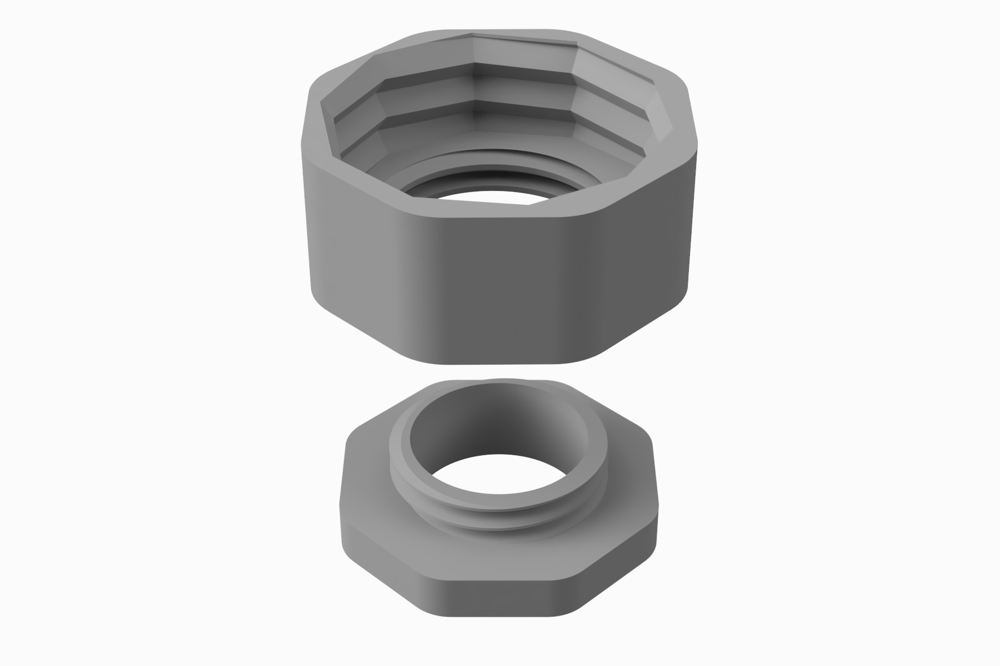
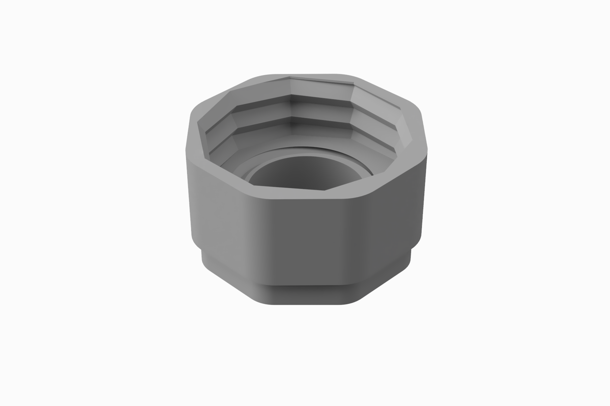

# OpenBCI dry electrode adapter
This folder contains stl-files for an adapter that enables the use of the spring-loaded dry 
electrodes from OpenBCI with a standard fNIRS/EEG cap. The project and intended hardware is described in this research article:
[Erichsen et al. (2020)](https://www.designsociety.org/publication/42519/Integration+of+low-cost%2C+dry-comb+EEG-electrodes+with+a+standard+electrode+cap+for+multimodal+signal+acquisition+during+human+experiments)

The adapter can be printed using a desktop 3D-printer.

## Suggested printing parameters
* Material: PLA
* Nozzle diameter: 0.4 mm
* Extruder temperature: 210 &#176;C (first layer: 215 &#176;C)
* Bed temperature: 60 &#176;C
* Layer height: 0.15 mm
* Perimeter vertical shells: 2
* Solid layers top: 7
* Solid layers bottom: 5

---
<figure>
  
  <figcaption>3D illustration of the adapter</figcaption>
</figure>

<figure>
  
  <figcaption>Illustration of the adapter assembled</figcaption>
</figure>

<figure>
  
  <figcaption>Illustration of the mount for the OpenBCI Cyton board</figcaption>
</figure>

<figure>
  
  <figcaption>Dry electrode mounted on the Easycap, outside view</figcaption>
</figure>

<figure>
  
  <figcaption>Dry electrode mounted on the Easycap, inside view</figcaption>
</figure>
